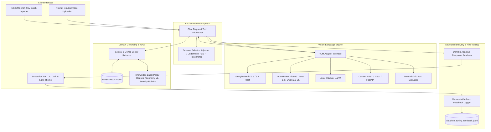

# ClaimLens: Multimodal Visual Assessment & Insurance Intelligence AI

[](https://www.python.org/downloads/)
[](https://streamlit.io/)
[](https://ai.google.dev/)
[](https://github.com/facebookresearch/faiss)
[](https://huggingface.co/docs/trl)
[](https://github.com/ranjanaashish/ClaimLens/actions)
[](Dockerfile)
[](https://share.streamlit.io/)
[](LICENSE)

ClaimLens is an enterprise-grade multimodal artificial intelligence platform designed for automated visual damage evaluation, agricultural and crop health inspection, property loss estimation, and policy-grounded insurance adjudication. Built on state-of-the-art Vision-Language Models (VLMs) and Retrieval-Augmented Generation (RAG), ClaimLens transforms unstructured visual inspections into verified, actionable engineering assessments.

---

## Key Highlights

- **Multi-Domain Visual Inspection**: Evaluates vehicle collision impact, agricultural blight and canopy health, structural roof and building damage, and arbitrary physical artifacts without cross-domain hallucinations.
- **Structured Factual Reporting**: Every inspection produces four deterministic deliverables: Executive Summary, Key Figures KPI Grid, Tabular Component Breakdown with OEM-grade action procedures, and Technical Diagnostic Reasoning.
- **Retrieval-Augmented Domain Grounding (RAG)**: Integrates vector search (FAISS + MiniLM) across statutory damage taxonomies, policy clauses, severity rubrics, and claims precedents with clickable citations.
- **Persona-Adaptive Feedback & Fine-Tuning Pipeline**: Context-aware human-in-the-loop critique capture (Adjuster, Underwriter, Customer Service, Researcher) exporting directly into DPO (Direct Preference Optimization) and SFT (Supervised Fine-Tuning) JSONL training pairs.
- **Clean, Minimalist Human Interface**: Inspired by ChatGPT and HimalAI; features native Dark/Light theme switching, responsive multi-column layouts, zero emoji clutter, and strict visual ergonomics.
- **Pluggable Model Architecture**: Native support for Google Gemini Vision, OpenRouter (Llama 3.2 Vision, Qwen 2.5 VL, Claude), OpenAI (GPT-4o), local offline Ollama (LLaVA), custom REST endpoints, and zero-dependency Stub mode.
- **INS-MMBench Benchmark Compliance**: Evaluated against the comprehensive multimodal insurance benchmark (INS-MMBench) with automated TSV, CSV, and Excel batch processing workflows.

---

## System Architecture



---

## Domain Capabilities

ClaimLens automatically infers the operational domain from the visual context and input prompt:

| Domain | Core Focus | Metrics & KPIs | Action Plan Output |
|---|---|---|---|
| **Automotive & Collision** | Panel intrusion, bumper crush, sheet metal buckling, glass fracture, frame alignment | Severity Badge, Repair Cost Range, Labor Hours, Anomaly Risk | Component breakdown, OEM repair procedures, sub-cost estimates |
| **Agricultural & Crops** | Crop blight, leaf lesions, canopy defoliation, fungal discoloration, growth stage | Foliage Impact %, Yield Risk %, Treatment Cost, Confidence | Affected foliage area, recommended biofungicide/sanitation actions |
| **Property & Structural** | Roof shingle loss, water ingress, wall fractures, siding degradation | Structural Risk Rating, Remediated Area, Sub-Cost | Structural element status, remediation procedure, building code alignment |
| **General Inspection** | Physical equipment defect classification, wear detection, object verification | Confidence Gauge, Observed State, Metric Status | Inspection findings, follow-up recommendations, status checklist |

---

## Persona Modes & Human-in-the-Loop Feedback

ClaimLens dynamically tailors reasoning and feedback criteria according to the selected user role:

- **Adjuster**: Technical damage inspection, repair procedures, parts replacement vs. repair trade-offs, labor hour realism, and damage codes.
- **Underwriter**: Risk exposure, policy exclusions, deductible calculation, total loss thresholds, and fraud/anomaly flags.
- **Customer Service**: Reassuring, empathetic tone, non-technical explanations, and clear next steps for policyholders.
- **Researcher / Demo**: Benchmark comparison, citation grounding, metric calculation consistency, and error rate tracking.

### Fine-Tuning Dataset Generation (SFT & DPO)

Every feedback submission records structured preference pairs directly into `data/fine_tuning_feedback.jsonl`:

```json
{
  "id": "ft_e192f93eca",
  "timestamp": "2026-09-05T07:06:18.520054Z",
  "persona": "Adjuster",
  "domain": "vehicle",
  "user_prompt": "Assess front bumper collision",
  "has_image": true,
  "response_text": "Front bumper crushed, repair cost $1,200 - $2,500.",
  "preference": "Accurate / Aligned",
  "tags": ["Accurate damage codes", "Fair labor / cost estimation"],
  "remarks": "Codes match OEM guide exactly.",
  "training_data": {
    "instruction": "Role: Adjuster. Query: Assess front bumper collision",
    "response": "Front bumper crushed, repair cost $1,200 - $2,500.",
    "chosen": "Front bumper crushed, repair cost $1,200 - $2,500.",
    "rejected": null,
    "critique": "Codes match OEM guide exactly.",
    "quality_rating": 1.0
  }
}
```

This dataset can be downloaded directly from the UI Settings panel and fed into fine-tuning frameworks such as Hugging Face `trl` (DPO / SFT) or Axolotl.

---

## Installation & Setup

### Prerequisites

- Python 3.10, 3.11, 3.12, or 3.13
- Git

### 1. Clone the Repository

```bash
git clone https://github.com/ranjanaashish/ClaimLens.git
cd ClaimLens
```

### 2. Set Up Virtual Environment

```bash
# Windows
python -m venv .venv
.venv\Scripts\activate

# Linux / macOS
python3 -m venv .venv
source .venv/bin/activate
```

### 3. Install Dependencies

```bash
pip install -r requirements.txt
```

### 4. Configure Environment (Optional for Live Models)

Copy the environment template:

```bash
cp .env.example .env
```

To run with live Google Gemini models, obtain a free API key from [Google AI Studio](https://aistudio.google.com/) and paste it into `.env` or directly into the web UI Settings panel:

```env
GEMINI_API_KEY=your_gemini_api_key_here
GEMINI_VLM_MODEL=gemini-3.6-flash
LLM_MODEL=gemini-3.6-flash
```

*(Note: If no API key is supplied, ClaimLens runs in Stub mode with full interactive functionality.)*

### 5. Launch Application

```bash
streamlit run streamlit_app.py
```

Navigate to `http://localhost:8501` in your browser.

---

## Cloud & Container Deployment

### 1. Streamlit Community Cloud (Recommended & Free)

Deploy directly from your GitHub repository with zero infrastructure management:

1. Navigate to [share.streamlit.io](https://share.streamlit.io/) and authenticate with your GitHub account (`ranjanaashish`).
2. Click **Create app** and configure:
   - **Repository**: `ranjanaashish/ClaimLens`
   - **Branch**: `main`
   - **Main file path**: `streamlit_app.py`
   - **App URL**: `claimlens.streamlit.app` (or custom subdomain)
3. *(Optional)* Expand **Advanced settings** -> **Secrets** to configure default environment variables:
   ```toml
   GEMINI_API_KEY = "your-api-key"
   GEMINI_VLM_MODEL = "gemini-3.6-flash"
   ```
4. Click **Deploy!** — Streamlit Cloud will build from `requirements.txt` and launch your instance with `.streamlit/config.toml` settings.

### 2. Docker Container Deployment

ClaimLens includes a production-ready `Dockerfile` and `.dockerignore`:

```bash
# Build the Docker image
docker build -t claimlens:latest .

# Run containerized on port 8501
docker run -d -p 8501:8501 \
  -e GEMINI_API_KEY="your-api-key" \
  --name claimlens-app \
  claimlens:latest
```

Compatible with **Render**, **Railway**, **Fly.io**, **AWS ECS**, and **Google Cloud Run**.

### 3. Hugging Face Spaces

1. Create a new Space at [huggingface.co/new-space](https://huggingface.co/new-space).
2. Select **Streamlit** (or **Docker**) as the Space SDK.
3. Link your GitHub repository (`ranjanaashish/ClaimLens`) or mirror the repo.

---

## Benchmark Integration (INS-MMBench)

ClaimLens supports evaluating large-scale datasets from **INS-MMBench**, the first multimodal benchmark for insurance intelligence:

1. **Batch Evaluation via Web UI**:
   - Open the **Import from Dataset File** drawer at the bottom of the chat interface.
   - Upload any `.tsv`, `.csv`, or `.xlsx` file containing an image column (supports Base64, URLs, or local file paths).
   - Select the number of rows to evaluate and click **Load & Assess All Rows**.

2. **Download Benchmark Datasets**:
   Run the automated Hugging Face downloader:
   ```bash
   python scripts/download_dataset.py
   ```

3. **Explore Quantitative Metrics**:
   Navigate to the **Eval Metrics** page to view interactive Plotly radar charts, confusion matrices, and category-level F1 scores compared against GPT-4V baselines.

---

## Project Structure

```
ClaimLens/
├── streamlit_app.py              # Application entry point & theme orchestrator
├── pages/
│   ├── chat.py                   # Primary chat interface & feedback engine
│   ├── 1_assessment.py           # Single-claim adjuster inspection workstation
│   ├── 2_knowledge_agent.py      # Standalone RAG conversational assistant
│   ├── 3_metrics.py              # Quantitative evaluation & radar charts
│   └── 4_batch_view.py           # Table review & batch evaluation dashboard
├── core/
│   ├── chat_engine.py            # Multimodal prompt routing & turn coordination
│   ├── vlm_adapter.py            # Vision backend adapter (Gemini, OpenRouter, Ollama, REST)
│   ├── rag_agent.py              # FAISS vector retriever & knowledge grounding
│   ├── response_renderer.py      # Domain-adaptive HTML card rendering
│   ├── feedback_store.py         # SQLite override store & DPO JSONL generator
│   ├── tsv_loader.py             # High-throughput TSV/CSV dataset parser
│   ├── llm_router.py             # Multi-provider LLM API router
│   └── schema.py                 # Core domain dataclasses & taxonomy definitions
├── assets/
│   └── style_chat.css            # Custom CSS system (dark/light theme, typography)
├── data/
│   ├── knowledge_base/           # Domain policies, rubrics, and statutory taxonomies
│   ├── sample_images/            # Reference inspection images
│   ├── eval_results.json         # Benchmark evaluation metrics
│   └── fine_tuning_feedback.jsonl # Generated SFT/DPO fine-tuning dataset
├── docs/
│   └── PRD.md                    # Product Requirements Document & design specifications
├── scripts/
│   └── download_dataset.py       # INS-MMBench Hugging Face dataset downloader
├── tests/
│   ├── test_chat_ui.py           # UI rendering and layout verification tests
│   ├── test_feedback_integration.py # DPO logging and quality rating tests
│   ├── test_rag_integration.py   # Vector retrieval and grounding verification
│   └── test_tsv_loader.py        # Dataset ingestion unit tests
├── .env.example                  # Environment variable configuration template
├── .gitignore                    # Git exclude configuration
├── LICENSE                       # MIT License
└── requirements.txt              # Production dependency specifications
```

---

## Automated Verification & Testing

To execute the test suite across all subsystems:

```bash
# Chat UI & renderer tests
python tests/test_chat_ui.py

# RAG grounding & retrieval tests
python tests/test_rag_integration.py

# Persona feedback & fine-tuning storage tests
python tests/test_feedback_integration.py

# Dataset ingestion tests
python tests/test_tsv_loader.py
```

---

## Security & Credential Hygiene

- **Zero Hardcoded Secrets**: All API credentials must be passed via environment variables or entered live through the UI.
- **Client-Side Storage**: In-memory session state persists user keys solely for the active session.
- **Excluded Sensitive Files**: `.gitignore` strictly omits `.env`, virtual environments, SQLite logs, and large benchmark artifacts (>100MB).

---

## License

Distributed under the [MIT License](LICENSE). Copyright (c) 2026 Aashish Ranjan.
